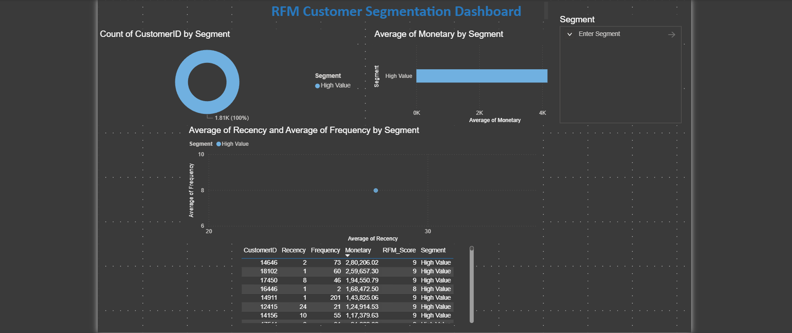

# RFM Customer Segmentation

## Overview
Performed RFM (Recency, Frequency, Monetary) Customer 
segmentation in Python on 500K+ UK retail transactions — 
segmented 4,338 customers into High, Mid, and Low Value tiers.

## Dashboard Preview

## Tools Used
- **Python (pandas)** — Data cleaning, RFM calculation, scoring
- **MySQL** — Exported RFM results to database
- **Power BI** — 4-visual segmentation dashboard

## What is RFM Analysis?
- **Recency** — How recently did the customer buy?
- **Frequency** — How often do they buy?
- **Monetary** — How much do they spend?

## Key Findings
- 4,338 unique customers segmented from 397,884 clean transactions
- High Value customers (score 7-9): top 28% by RFM score
- Low Value customers show 300+ days recency on average
- High Value customers spend 8x more than Low Value customers

## Python Steps
1. Loaded dataset with pandas (541,909 rows)
2. Cleaned: removed nulls, returns, negative prices
3. Calculated Recency, Frequency, Monetary per customer
4. Scored each metric 1-3 using pd.qcut()
5. Assigned High/Mid/Low segments by total RFM score

## Visuals Built
- Donut chart: Customer count by segment
- Bar chart: Average spend by segment
- Scatter plot: Recency vs Frequency (colored by segment)
- Table: Top High Value customers

## Dataset
Online Retail Dataset — UCI Machine Learning Repository
